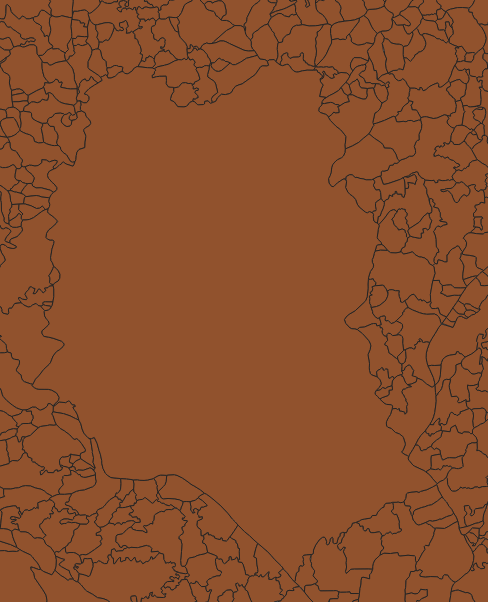
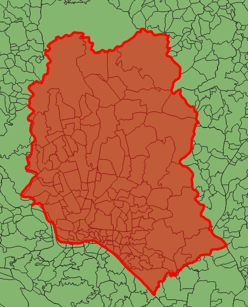
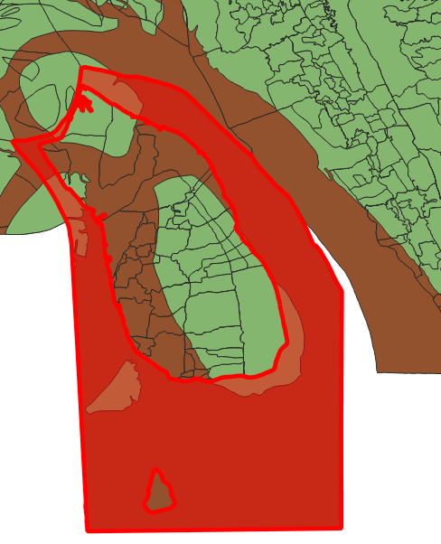
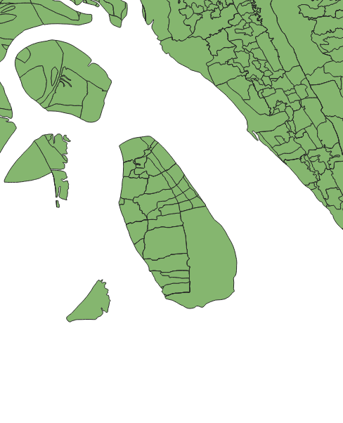
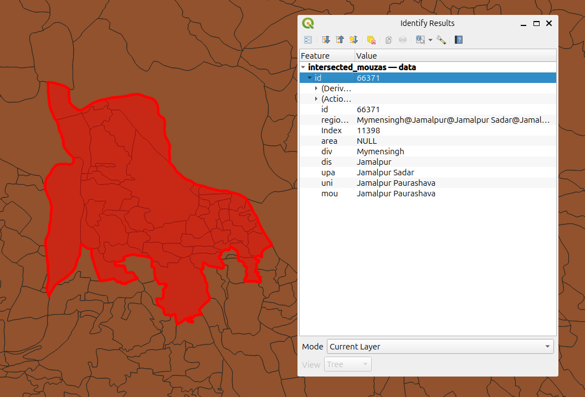
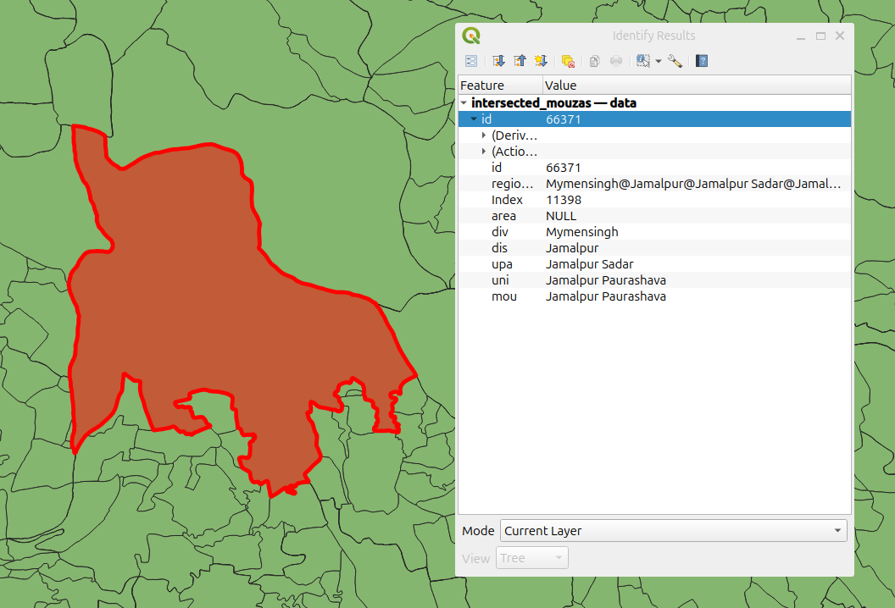

# Model6

## Using and deploying the model

### How to run the model and generate estimates

Note that poetry 1.8.2 is a system requirement.

```shell
poetry install
poetry run python main.py
```

### How to upload model estimates and processed geodata to google cloud

1. Login to google cloud by tying `gcloud auth login` and
using iarsenic24@gmail.com credentials
2. Set the google cloud project to model6-storage 
`gcloud config set project model6-storage`
3. Run rsync from the model6 directory `gsutil -m rsync -r model/ gs://iarsenic-model6/model`
4. Upload Mouza geojson files (grouped by Upazila) `gsutil -m rsync -r output/geodata/mouza-by-upazila gs://iarsenic-model6/geodata/mouza-by-upazila`
5. Upload generated topojson files `gsutil -m cp output/geodata/*.topojson gs://iarsenic-model6/geodata/`
6. Upload generated geojson files (required by server for turf) `gsutil -m cp output/geodata/*.geojson gs://iarsenic-model6/geodata/`

## How does this model differ from model5

### Dropdown Data 

In model6, the dropdown data is created from the geodata. This ensures that we
produce predictions for every area in Bangladesh.

Previous models used the training data to produce dropdown data, 
this however, excluded regions not included in the training data meaning it
was impossible to select many regions in the region selector.

### Model data stored in google cloud bucket

Model6 produces 497MB over 124334 files (one file for each region).
Previously model5 has stored this in the source code but because of
the size of model6 this is no longer feasible.

The model6 storage bucket it kept in the google cloud project
model6-storage. It is accessed by both the staging and production
deployment to avoid duplicating resources.

## Geodata preprocessing

### Regions larger than parent are split

Where a region exceeds the size of its parent region, it is 
split by the borders of its parent regions. This ensures
that each region is entirely contained by its parent.

This is best shown with the Dhaka region. When in the Dhaka
mouza, you could be in several union regions. Splitting the
Dhaka mouza into multiple regions based on the border of 
its parent union region ensures that for any union within Dhaka,
predictions can be generated.

#### Dhaka before split


#### Dhake after split


If a region has no parent after being split, it is removed.

See the example below where the cleaned geodata is overlayed in green. The
red selected region shows an example region that is not entirely contained
within a parent region, even after splitting.

This does mean that areas where the region was removed cannot
be selected for prediction generation. While this is a problem,
we have no way of producing predictions for these regions anyway
because a region requires a parent to be selected.

#### Parentless region before removal


#### Data after parentless region removal


### Parent regions are determined by containing region

Child region labels are overwritten by their geographic parent region,
elminating the possbility of a region's parent label not matching
its geographic parent.

### Regions with missing data labels inheret label from parent

Some mouzas do not have a mouza name, this is often the case
with Paurashava regions. In this case, the mouza name is taken
from the union name of the parent union.

### Regions with matching names are merged

Inhereting union names cant result in duplicate region names. This 
often happens with mouzas within Paurashavas. In this case the 
regions with duplicate names is merged into a single region.

#### Paurashava with duplicate names in child mouzas 


#### Mouzas with duplicate names merged


## Generating model data

Model6 follows the same logic as model5 to produce estimate data
but adds a model patch to fall back on for region strata that do
not have 7+ data points.


## Producing an estimate

The model produces a message code based on the
median and maximum arsenic concentration of wells within 
a region depth strata, the arsenic value at the lowest 10%
of samples and the arsenic calue of the highest 90%. 

For the flooding model, the 25th percentile, 75th percentile
and 95th percentile are also calculated.

Where there are not enough data points within a region depth
strata, the model patch is used to to generate only the 
message code.

This data is used by the app to produce the risk estimate that
is provided to the user.

## Model error logs

Model error logs are written to 
`preprocessing/models/model6/logs/generate_prediction_data`

During model generation, 3 files are produced:

**failed_to_write_model.txt**

This file contains filenames that failed to write for given regions

This is usually because a region name (which 
is included in the filename) contains a / character.

**not_enough_data.txt**

This file outputs regions and their strata where
model data was unable to be produced because there
was not enough data within the region depth strata
or the model patch.

**patch_used.txt**

This file contains regions and their strata where the 
model patch was used.